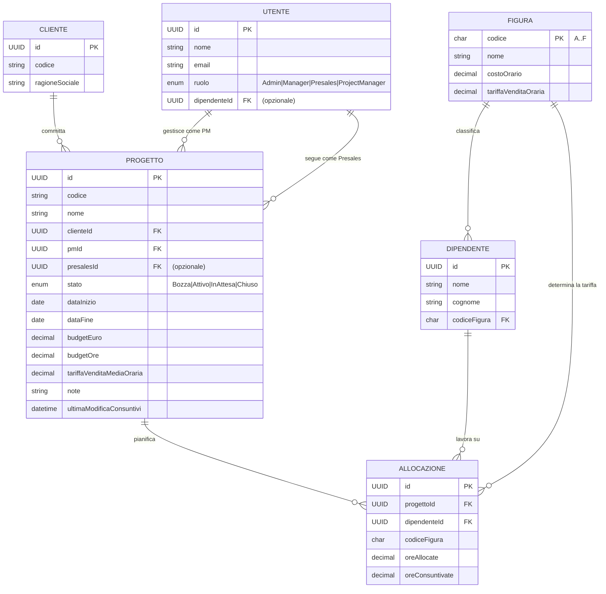

# Analisi Funzionale — TeamFit

> Versione: 1.0 — 2026-06-20
> Stato: Draft MVP

---

## 1. Introduzione

### 1.1 Scopo del documento

Questo documento descrive le funzionalità della piattaforma **TeamFit** dal punto di vista degli utenti finali. È il riferimento per la validazione dei requisiti, la pianificazione dei test di accettazione e l'onboarding di nuovi membri del team.

Per i dettagli tecnici si rimanda a [architecture.md](architecture.md), [domain-model.md](domain-model.md) e [guidelines.md](guidelines.md).

### 1.2 Obiettivo di prodotto

TeamFit è una piattaforma SaaS per la **gestione e ottimizzazione economica dei progetti** erogati da aziende di servizi ai propri clienti. Il problema centrale che risolve è: **Project Manager e Manager scoprono troppo tardi quando un progetto sta bruciando budget**. TeamFit fornisce visibilità in tempo reale su consumo, forecast e margine, e genera alert prima che il danno sia irreversibile.

### 1.3 Ambito MVP

Il presente documento copre il perimetro dell'**MVP**. Le funzionalità fuori scope sono elencate nella sezione 9.

---

## 2. Attori e Ruoli

### 2.1 Profili utente

| Ruolo | Descrizione |
| --- | --- |
| **ADMIN** | Amministratore della piattaforma. Accesso illimitato a tutti i dati e funzioni. |
| **MANAGER** | Responsabile aziendale. Visibilità su tutti i progetti, crea e modifica progetti. |
| **PROJECT_MANAGER (PM)** | Gestore del singolo progetto. Vede e consuntiva solo i propri progetti. |
| **PRESALES** | Responsabile commerciale. Accesso in sola lettura ai progetti di propria competenza. |

### 2.2 Matrice accessi

| Funzione | ADMIN | MANAGER | PROJECT_MANAGER | PRESALES |
| --- | :---: | :---: | :---: | :---: |
| Visualizza tutti i progetti | ✓ | ✓ | — | — |
| Visualizza propri progetti | ✓ | ✓ | ✓ (solo `PmId == self`) | ✓ (solo `PresalesId == self`) |
| Crea progetto | ✓ | ✓ | — | — |
| Modifica anagrafica progetto | ✓ | ✓ | — | — |
| Cambia stato progetto | ✓ | ✓ | — | — |
| Gestisce allocazioni | ✓ | ✓ | — | — |
| Aggiorna ore consuntivate | ✓ | ✓ | ✓ (solo propri) | — |
| Visualizza dashboard KPI | ✓ | ✓ | ✓ (propri) | ✓ (propri) |
| Visualizza alert | ✓ | ✓ | ✓ (propri) | ✓ (propri) |
| Gestisce clienti | ✓ | ✓ | — | — |
| Gestisce dipendenti | ✓ | ✓ | — | — |

### 2.3 Autenticazione (MVP)

L'autenticazione è **mock**: l'utente seleziona la propria identità da un dropdown nella barra dell'applicazione. Il ruolo viene caricato automaticamente in base all'utente scelto. Non è richiesta password.

---

## 3. Moduli Funzionali

### 3.1 Modulo Progetti

Il modulo centrale della piattaforma. Gestisce l'intero ciclo di vita dei progetti.

#### 3.1.1 Lista progetti

- Visualizza tutti i progetti accessibili all'utente corrente (filtrati per ruolo).
- Per ogni progetto mostra: codice, nome, cliente, stato, PM, date, budget €, KPI sintetici (write-up/write-off, % budget consumato).
- Badge colorati indicano lo stato del progetto (Bozza, Attivo, In Attesa, Chiuso).
- Indicatore visivo se il progetto ha alert attivi.
- Possibilità di filtrare per stato, cliente, PM.

#### 3.1.2 Dettaglio progetto

- Scheda completa con tutte le informazioni anagrafiche.
- Sezione KPI calcolati in tempo reale (vedi sezione 4).
- Lista allocazioni con ore pianificate e consuntivate per ciascun dipendente.
- Sezione alert attivi sul progetto.
- Sezione note.

#### 3.1.3 Creazione progetto

Campi obbligatori:
- **Codice**: stringa alfanumerica, max 20 caratteri, univoco.
- **Nome**: descrizione del progetto.
- **Cliente**: selezione da anagrafica clienti.
- **PM**: selezione da lista utenti con ruolo PROJECT_MANAGER.
- **Data inizio** e **data fine**: la fine deve essere successiva all'inizio.
- **Budget €**: importo in euro, deve essere > 0.
- **Budget ore**: ore totali pianificate, deve essere > 0.
- **Tariffa di vendita media oraria**: €/ora, deve essere > 0.

Campi opzionali:
- **Presales**: utente con ruolo PRESALES associato al progetto.
- **Note**: testo libero.

Lo stato iniziale è sempre **Bozza (Draft)**.

#### 3.1.4 Modifica progetto

ADMIN e MANAGER possono modificare tutti i campi anagrafici di un progetto in qualsiasi stato diverso da Chiuso. Le stesse regole di validazione della creazione si applicano.

#### 3.1.5 Ciclo di vita (stati)

```
Bozza (Draft) ──► Attivo (Active) ──► In Attesa (OnHold) ──► Attivo (Active)
                              │
                              └──► Chiuso (Closed)
In Attesa (OnHold) ──► Chiuso (Closed)
```

| Transizione | Condizioni richieste |
| --- | --- |
| Bozza → Attivo | PM assegnato + almeno 1 allocazione presente |
| Attivo → In Attesa | Nessuna condizione aggiuntiva |
| Attivo → Chiuso | Nessuna condizione aggiuntiva |
| In Attesa → Attivo | Nessuna condizione aggiuntiva |
| In Attesa → Chiuso | Nessuna condizione aggiuntiva |

Un progetto **Chiuso** non può più essere modificato.

#### 3.1.6 Gestione allocazioni

Un'allocazione rappresenta l'assegnazione di un dipendente a un progetto con un numero di ore pianificate.

- ADMIN e MANAGER possono aggiungere/rimuovere allocazioni su progetti non Chiusi.
- Ogni dipendente può essere allocato **una sola volta** per progetto (MVP).
- Per ogni allocazione si specificano: dipendente, ore allocate.
- La figura professionale dell'allocazione è determinata dalla figura corrente del dipendente.
- Le ore allocate devono essere > 0.
- Le ore consuntivate possono superare le ore allocate (genera un alert, ma non è bloccato).
- Non è possibile rimuovere allocazioni da un progetto Chiuso.

#### 3.1.7 Aggiornamento consuntivi

- PM, ADMIN e MANAGER possono aggiornare le **ore consuntivate** sulle singole allocazioni.
- Il PM può modificare solo le allocazioni dei propri progetti.
- L'aggiornamento registra il timestamp dell'ultima modifica (usato per l'alert `NO_ACTIVITY`).
- Le ore consuntivate non possono essere negative.
- Il campo è editabile inline nella lista delle allocazioni del progetto.

---

### 3.2 Modulo Clienti

Anagrafica dei clienti finali per cui vengono erogati i progetti.

#### 3.2.1 Lista clienti

- Tabella con codice, ragione sociale, contatti opzionali.
- Accessibile a ADMIN e MANAGER.
- Numero di progetti attivi per cliente (indicativo).

#### 3.2.2 Creazione / Modifica cliente

Campi:
- **Codice**: stringa alfanumerica, max 20 caratteri, univoco.
- **Ragione Sociale**: testo, max 200 caratteri, obbligatorio.
- Campi contatto opzionali (email referente, telefono, ecc.).

---

### 3.3 Modulo Forza Lavoro

Gestione del catalogo delle figure professionali e dell'anagrafica dipendenti.

#### 3.3.1 Figure professionali

Catalogo statico delle figure A→F con tariffe associate:

| Codice | Nome | Costo Orario (€) | Tariffa Vendita (€/h) |
| --- | --- | --- | --- |
| A | Junior | — | — |
| B | Mid | — | — |
| C | Senior | — | — |
| D | Lead | — | — |
| E | Principal | — | — |
| F | Partner / Director | — | — |

I valori effettivi sono configurati nel seed del database. La modifica delle tariffe è fuori scope MVP.

#### 3.3.2 Dipendenti

- Lista dipendenti con nome, cognome, figura professionale assegnata.
- Creazione e modifica disponibili per ADMIN e MANAGER.
- Un dipendente ha una sola figura professionale (MVP).

---

### 3.4 Modulo Dashboard

Vista aggregata dei KPI economici per il portafoglio progetti.

#### 3.4.1 Dashboard globale (ADMIN / MANAGER)

- Totale progetti per stato.
- Somma write-up / write-off aggregata su tutti i progetti attivi.
- Grafico andamento budget consumato (Recharts).
- Numero di alert attivi con distribuzione per severity (Warning / Critical).
- Lista dei progetti più a rischio (ordinati per % budget consumato o forecast over budget).

#### 3.4.2 Dashboard filtrata per ruolo

- **PROJECT_MANAGER**: stessi KPI ma solo sui propri progetti (`PmId == self`).
- **PRESALES**: stessi KPI ma solo sui propri progetti (`PresalesId == self`), in sola lettura.

---

### 3.5 Modulo Alerting

Sistema di notifiche proattive sui rischi economici dei progetti.

#### 3.5.1 Generazione alert

Gli alert vengono calcolati **on-demand** su tutti i progetti in stato Attivo. Non sono persistiti in database (MVP): vengono ricalcolati a ogni richiesta.

#### 3.5.2 Regole di alerting

| Codice | Descrizione | Severity |
| --- | --- | --- |
| `BUDGET_WARN` | Il costo sostenuto supera il 70% del budget € (ma è < 90%) | ⚠ Warning |
| `BUDGET_CRIT` | Il costo sostenuto supera il 90% del budget € | 🔴 Critical |
| `FORECAST_OVER` | Il forecast a finire (EAC) supera il budget € | 🔴 Critical |
| `MARGIN_LOW` | Il margine % è inferiore al 15% (con ricavo > 0) | ⚠ Warning |
| `OVERRUN_ALLOC` | Almeno un dipendente ha ore consuntivate > ore allocate | ⚠ Warning |
| `NO_ACTIVITY` | Nessun aggiornamento consuntivi negli ultimi 14 giorni | ⚠ Warning |

#### 3.5.3 Visualizzazione alert

- **Badge in header**: contatore degli alert attivi visibili all'utente corrente.
- **Pagina `/alert`**: lista completa degli alert con dettaglio per progetto, regola, severity e data/ora di rilevamento.
- Gli alert sono filtrati per ruolo: il PM vede solo gli alert sui propri progetti.

---

## 4. KPI e Calcoli Economici

I KPI sono calcolati lato backend (livello Application) e restituiti nelle risposte API. Il frontend non esegue calcoli economici.

### 4.1 Definizioni

| KPI | Formula |
| --- | --- |
| **Ricavo Riconosciuto** | `Σ (OreConsuntivate × TariffaVenditaOraria della figura)` per tutte le allocazioni del progetto |
| **Costo Sostenuto** | `Σ (OreConsuntivate × CostoOrario della figura)` per tutte le allocazioni del progetto |
| **Write-Up** | `RicavoRiconosciuto − CostoSostenuto` (positivo = margine; negativo = perdita) |
| **% Budget Consumato** | `CostoSostenuto / BudgetEuro × 100` |
| **Forecast a Finire (EAC)** | `CostoSostenuto / OreConsuntivateTotali × OreAllocateTotali` (se ore consuntivate > 0, altrimenti 0) |
| **Margine %** | `WriteUp / RicavoRiconosciuto × 100` (se ricavo > 0) |

### 4.2 Interpretazione

- **Write-Up positivo** → il progetto sta generando margine.
- **Write-Off** (Write-Up negativo) → il progetto sta erodendo valore.
- **EAC > BudgetEuro** → il progetto, al ritmo attuale, chiuderà sopra budget.
- **Margine % < 15%** → margine insufficiente, rischio write-off.

---

## 5. Flussi Principali (Use Case)

### UC-01 — Creazione e avvio di un nuovo progetto

**Attore**: MANAGER o ADMIN
**Precondizioni**: cliente e PM esistono in anagrafica.

1. Il Manager accede a "Nuovo Progetto" dalla lista progetti.
2. Compila i campi obbligatori (codice, nome, cliente, PM, date, budget € e ore, tariffa media).
3. Salva: il progetto viene creato in stato **Bozza**.
4. Accede al dettaglio del progetto e aggiunge le allocazioni (dipendente + ore pianificate).
5. Cambia lo stato in **Attivo**.

**Postcondizioni**: il progetto è visibile nella lista del PM assegnato; gli alert sono attivi su di esso.

---

### UC-02 — Aggiornamento consuntivi da parte del PM

**Attore**: PROJECT_MANAGER
**Precondizioni**: progetto in stato Attivo con allocazioni.

1. Il PM accede al dettaglio del proprio progetto.
2. Individua le allocazioni del periodo.
3. Aggiorna inline le **ore consuntivate** per ciascun dipendente.
4. Il sistema ricalcola automaticamente i KPI e aggiorna `UltimaModificaConsuntivi`.

**Postcondizioni**: i KPI del progetto sono aggiornati; eventuali nuovi alert vengono generati al successivo accesso alla pagina alert.

---

### UC-03 — Monitoraggio alert da parte del Manager

**Attore**: MANAGER o ADMIN
**Precondizioni**: almeno un progetto Attivo con dati.

1. Il Manager visualizza il badge alert in header (numero di alert critici/warning).
2. Naviga alla pagina `/alert`.
3. Visualizza la lista degli alert ordinati per severity.
4. Clicca su un alert per accedere al progetto coinvolto.
5. Valuta i KPI e decide l'azione correttiva (riallocazione risorse, rinegoziazione budget, ecc.).

---

### UC-04 — Chiusura di un progetto

**Attore**: MANAGER o ADMIN
**Precondizioni**: progetto in stato Attivo o In Attesa.

1. Il Manager accede al dettaglio del progetto.
2. Seleziona la transizione "Chiudi Progetto".
3. Il progetto passa in stato **Chiuso**.
4. Tutte le modifiche (allocazioni, consuntivi) sono bloccate.

---

### UC-05 — Accesso in sola lettura da parte del Presales

**Attore**: PRESALES
**Precondizioni**: utente con ruolo Presales assegnato come `PresalesId` su almeno un progetto.

1. Il Presales effettua il login (seleziona la propria identità).
2. Visualizza la dashboard con i soli progetti di sua competenza.
3. Accede al dettaglio di un progetto: vede KPI, allocazioni, alert in sola lettura.
4. Non può modificare nulla.

---

## 6. Regole di Business Riepilogative

1. Un progetto non può passare da Bozza ad Attivo senza PM e senza almeno un'allocazione.
2. Un progetto Chiuso non può essere modificato in nessun campo.
3. Un dipendente può comparire una sola volta per progetto (una sola allocazione per progetto MVP).
4. Le ore consuntivate non possono essere negative.
5. Il superamento delle ore allocate è consentito ma genera l'alert `OVERRUN_ALLOC`.
6. Il KPI di margine non viene calcolato se il ricavo riconosciuto è zero (divisione per zero evitata).
7. L'EAC è zero se non ci sono ancora ore consuntivate.
8. La soglia "no attività" è fissa a 14 giorni (non configurabile nell'MVP).
9. La soglia margine basso è fissa al 15% (non configurabile nell'MVP).
10. Le soglie budget warning/critical sono fisse al 70% e 90% (non configurabili nell'MVP).
11. I costi orari e le tariffe di vendita sono per figura professionale, non per singolo dipendente (MVP).

---

## 7. Modello Dati Funzionale

### 7.1 Entità principali



### 7.2 Dati di seed (MVP)

Per la demo e lo sviluppo il sistema include:

- **3 clienti** con ragione sociale e codice.
- **6 figure professionali** (A→F) con costi e tariffe realistiche.
- **15 dipendenti** distribuiti tra le figure.
- **5 utenti** (1 ADMIN, 1 MANAGER, 1 PRESALES, 2 PROJECT_MANAGER).
- **8 progetti** con mix di stati: almeno 2 con alert attivi per validare il motore di alerting.

---

## 8. Requisiti Non Funzionali (MVP)

| Categoria | Requisito |
| --- | --- |
| **Performance** | Risposta API < 500 ms per le query principali (lista progetti, KPI, alert). |
| **Sicurezza** | Input sempre validato lato server (FluentValidation). Niente SQL raw concatenato (EF Core LINQ). CORS limitato ai soli origin autorizzati. |
| **Usabilità** | UI in italiano. Messaggi di errore comprensibili. Feedback visivo immediato su salvataggio. |
| **Compatibilità browser** | Ultimi 2 major di Chrome, Edge, Firefox. |
| **Accessibilità** | Standard base Ant Design (WCAG 2.1 AA per i componenti di libreria). |
| **Manutenibilità** | Architettura DDD a layer; zero logica di business nei controller o nei componenti React. |
| **Testabilità** | Almeno 1 test xUnit per ogni invariante di dominio e per ogni regola di alerting. |

---

## 9. Fuori Scope MVP

Le seguenti funzionalità sono **escluse** dalla presente analisi e non devono essere implementate senza richiesta esplicita:

- Timesheet giornaliero o settimanale
- Pipeline opportunità Presales (pre-progetto)
- Export Excel / PDF
- Notifiche email o Teams
- Audit log e cronologia modifiche
- Multi-tenant
- Deploy effettivo su Azure
- Autenticazione reale (Entra ID / ASP.NET Identity / JWT)
- Localizzazione multi-lingua
- Override costo orario per singolo dipendente (override per-employee vs per-figura)
- Configurazione dinamica delle soglie di alerting
- Report storici e trending KPI
- Gestione risorse / capacity planning cross-progetto

---

## 10. Glossario

Vedi [project-context.md §2](project-context.md#2-glossario) per il glossario completo dei termini di dominio.

---

## 11. Riferimenti

| Documento | Contenuto |
| --- | --- |
| [project-context.md](project-context.md) | Scope, KPI, ruoli, regole alerting, decisioni MVP |
| [domain-model.md](domain-model.md) | Aggregate, invarianti, metodi di dominio, ER tecnico |
| [architecture.md](architecture.md) | Stack tecnologico, layer DDD, bounded context, deploy |
| [guidelines.md](guidelines.md) | Coding standards backend e frontend, naming, commit |
| [README.md](../README.md) | Setup locale, comandi rapidi |
