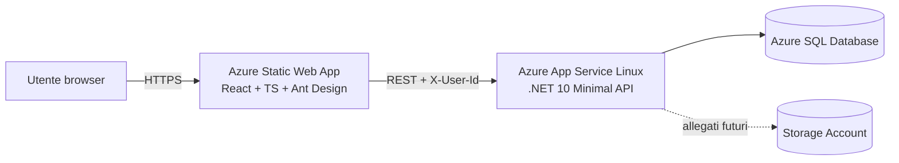
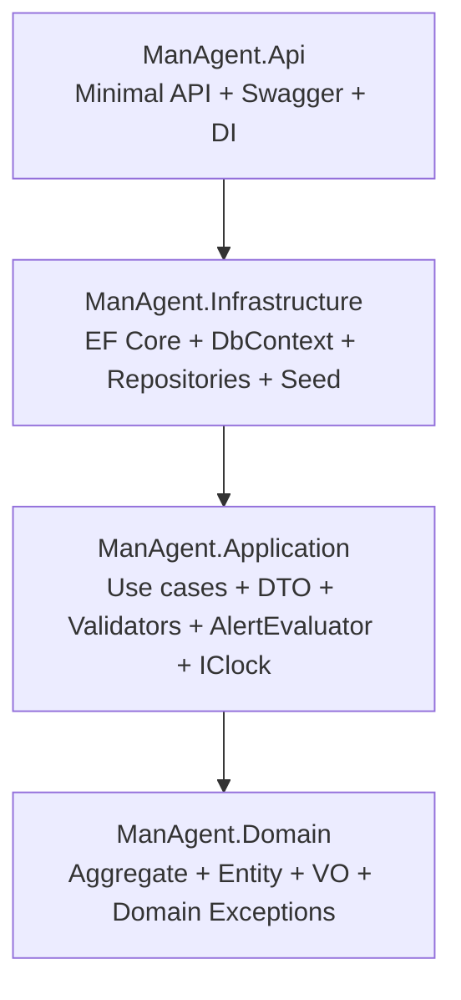
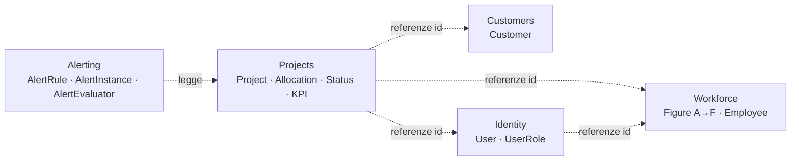
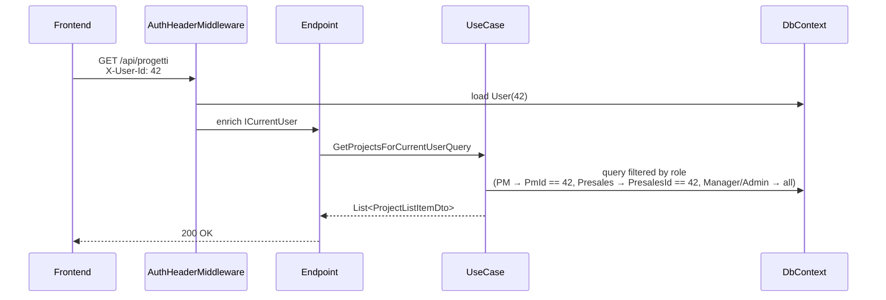
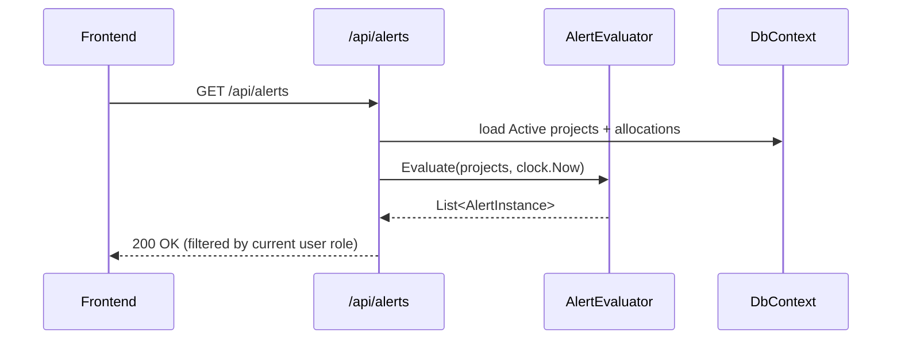
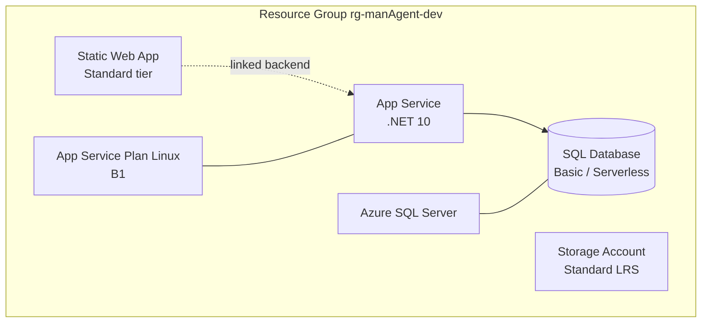

# Architecture — Man-Agent

> Documento vivo. Aggiornare quando cambiano bounded context, layer o topologia di deploy.

## 1. Vista d'insieme

Man-Agent è una SPA React che consuma una API .NET 10 (minimal API) basata su
DDD a 4 layer, persistenza Azure SQL via EF Core. Single-tenant. Auth mock.

In dev locale: Vite (`:5173`) → proxy → Kestrel (`:5000`) → LocalDB / SQL Express.

## 2. Backend: layer DDD

Regola: **le dipendenze puntano sempre verso l'interno** (Onion). `Domain` non ha
dipendenze esterne (solo BCL).

## 3. Bounded Context

Comunicazione **per id**, no foreign-key cross-context fra aggregate (regola DDD).
EF Core mappa le relazioni a livello DB per query efficaci, ma il codice di
dominio non naviga riferimenti cross-context.

## 4. Flusso autorizzazione (mock)

## 5. Flusso alerting

L'evaluator è puro: input → output, niente side effect. Per l'MVP non persistiamo
gli alert (sono ricalcolati on-demand).

## 6. Deploy target Azure (predisposto, no apply nell'MVP)

Risorse Terraform:
- `azurerm_resource_group`
- `azurerm_static_web_app`
- `azurerm_service_plan` + `azurerm_linux_web_app`
- `azurerm_mssql_server` + `azurerm_mssql_database`
- `azurerm_storage_account`

Output: hostname SWA, hostname Web App, connection string SQL (sensitive).

## 7. Versioning componenti

| Componente | Versione target |
| --- | --- |
| .NET | 10 (preview/RTM disponibile) |
| EF Core | 10.x |
| Node.js | LTS corrente (≥ 20) |
| Vite | 5.x |
| React | 18.x |
| TypeScript | 5.x |
| Ant Design | 5.x |
| TanStack Query | 5.x |
| Zustand | 4.x |
| Recharts | 2.x |
| Terraform | ≥ 1.7 |
| azurerm provider | ≥ 3.100 |

Le versioni esatte vengono congelate nei file `csproj`, `package.json`, `versions.tf` durante la Fase 2.
