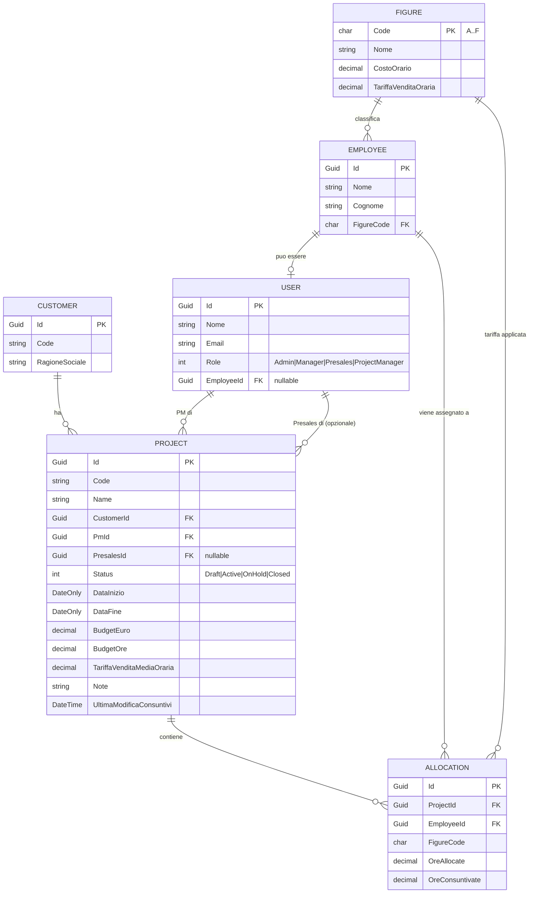

# Domain Model — TeamFit

> Documento vivo. Aggiornare ogni volta che cambia un aggregate, un invariante o una relazione.

Definizioni operative dei KPI in [project-context.md §3](project-context.md#3-definizione-operativa-dei-kpi).

## 1. Diagramma ER concettuale



## 2. Aggregate roots

| Aggregate | Bounded context | Entity child | Note |
| --- | --- | --- | --- |
| `Project` | Projects | `Allocation` | Cuore del dominio. Tutte le mutazioni passano da metodi. |
| `Customer` | Customers | — | CRUD semplice. |
| `Employee` | Workforce | — | Riferito da `Allocation` via id. |
| `Figure` | Workforce | — | Catalogo statico A→F, modificabile solo da Admin (post-MVP). |
| `User` | Identity | — | Solo per dropdown login e filtri ruolo. |
| `AlertInstance` | Alerting | — | Non persistito nell'MVP, generato in memoria. |

## 3. Value Objects (Domain/Shared/)

| VO | Forma | Invariants |
| --- | --- | --- |
| `Money` | `record struct (decimal Amount, string Currency = "EUR")` | `Amount >= 0`, currency non vuota. |
| `Hours` | `record struct (decimal Value)` | `Value >= 0`. |
| `ProjectCode` | `record struct (string Value)` | non vuoto, max 20 char, alfanumerico + `-`. |
| `Percentage` | `record struct (decimal Value)` | `0 <= Value <= 100` per soglie; `>= -100` per margini negativi (consenti). |
| `FigureCode` | `record struct (char Code)` | `Code ∈ {A,B,C,D,E,F}`. |

## 4. Invariants per aggregate

### `Project`
- `BudgetEuro > 0` e `BudgetOre > 0`.
- `DataInizio < DataFine`.
- `TariffaVenditaMediaOraria > 0`.
- Per passare a `Active`: deve avere `PmId` valorizzato e almeno 1 `Allocation`.
- Per passare a `Closed`: stato precedente ∈ {`Active`, `OnHold`}.
- `Allocation.OreConsuntivate >= 0` (può superare `OreAllocate`: genera alert ma non eccezione).
- `RegistraConsuntivo` aggiorna `UltimaModificaConsuntivi = clock.UtcNow`.
- Un'allocazione per coppia `(EmployeeId)` (un dipendente compare 1 sola volta per progetto MVP).

### `Customer`
- `RagioneSociale` non vuota, max 200.
- `Code` non vuoto, max 20, univoco (controllo applicativo).

### `Employee`
- `Nome` e `Cognome` non vuoti.
- `FigureCode` deve esistere nel catalogo `Figure`.

### `Figure`
- `CostoOrario >= 0`, `TariffaVenditaOraria >= 0`, normalmente `TariffaVenditaOraria > CostoOrario`.
- `Code` univoco.

### `User`
- `Email` non vuota, formato valido.
- Se `Role == ProjectManager` o `Presales` → `EmployeeId` deve essere valorizzato (per coerenza demo).

## 5. Metodi di dominio principali (`Project`)

| Metodo | Effetto | Eccezioni |
| --- | --- | --- |
| `static Project Create(...)` | Factory che valida invariants. | `InvalidProjectDataException` |
| `AggiungiAllocazione(employeeId, figureCode, oreAllocate)` | Aggiunge child Allocation. | `DuplicateAllocationException` |
| `RimuoviAllocazione(allocationId)` | Solo se `Status != Closed`. | `InvalidProjectStateException` |
| `RegistraConsuntivo(allocationId, ore, clock)` | Aggiorna `OreConsuntivate` e `UltimaModificaConsuntivi`. | `AllocationNotFoundException`, `InvalidHoursException` |
| `CambiaStato(nuovoStato)` | Transizione stati valida. | `InvalidProjectStateException` |
| `AggiornaAnagrafica(name, dates, budget, ...)` | Modifica campi base, ri-valida invariants. | `InvalidProjectDataException` |

Stati ammessi e transizioni:

```
Draft ──► Active ──► OnHold ──► Active
                 │
                 └──► Closed
OnHold ──► Closed
```

## 6. Eventi di dominio (opzionale MVP)

Non strettamente necessari. Se servono in futuro:
- `ProjectStatusChanged`
- `AllocationConsumptionRecorded`

Per ora i KPI/alert si calcolano on-demand dall'`AlertEvaluator`.

## 7. Calcoli derivati (Application, non Domain)

Esposti da `ProjectKpiCalculator` in `Application/Projects/Services/`:

```csharp
public sealed record ProjectKpi(
    decimal RicavoRiconosciuto,
    decimal CostoSostenuto,
    decimal WriteUp,
    decimal BudgetConsumatoPct,
    decimal ForecastAFinireCost,
    decimal? MarginePct);
```

Formule in [project-context.md §3](project-context.md#3-definizione-operativa-dei-kpi).

## 8. Regole alerting (Application/Alerting/)

`AlertEvaluator.Evaluate(IEnumerable<Project>, IFigureCatalog, IClock)` ritorna
`IEnumerable<AlertInstance>` applicando le 6 regole MVP. Vedi
[project-context.md §5](project-context.md#5-regole-di-alerting-motore).
